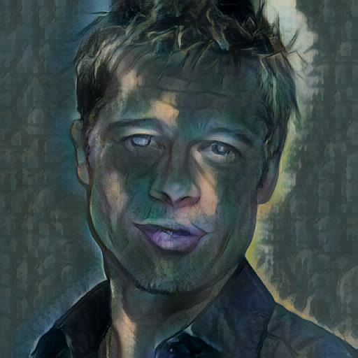

# Neural Style Transfer with AdaIN

A PyTorch implementation of **Arbitrary Style Transfer in Real-time with Adaptive Instance Normalization (AdaIN)**, deployed as an interactive Flask web application. Upload any content image and any style image, and generate a stylized result in real time.


## 🎨 Overview

This project implements the AdaIN style transfer technique introduced by Huang & Belongie (2017), which allows arbitrary style transfer without retraining the network for each new style — unlike earlier approaches that required a separate model per style.

**How it works:**
1. A pretrained, frozen **VGG-19 encoder** extracts feature representations from both the content and style images.
2. The **AdaIN layer** aligns the mean and variance of the content features to match the style features — transferring style statistics while preserving content structure.
3. A trainable **decoder** reconstructs an image from these stylized features.
4. Only the decoder is trained; the encoder remains fixed throughout.

## 🖥️ Demo

Upload a content image and a style image through the web interface, adjust the style strength (alpha), and get an instant stylized output.

## 🏗️ Project Structure
├── app.py                 # Flask web application (inference)
├── train.py               # Training script
├── requirements.txt       # Python dependencies
├── utils/
│   ├── models.py          # VGGEncoder and Decoder architecture
│   └── utils.py           # AdaIN function, dataset loader, transforms
├── templates/
│   └── index.html         # Web app frontend
├── examples/              # Sample images for the demo showcase
└── experiment/            # Saved model checkpoints (not included in repo)

## ⚙️ Setup

### 1. Clone the repository
```bash
git clone https://github.com/Git-Amann/neural-style-transfer-adain.git
cd neural-style-transfer-adain
```

### 2. Create a virtual environment
```bash
conda create -n adain_env python=3.10
conda activate adain_env
```

### 3. Install dependencies
```bash
pip install -r requirements.txt
```

### 4. Download the pretrained VGG weights
This project uses a normalized VGG-19 encoder (as used in the original AdaIN paper). Download `vgg_normalised.pth` and place it in the project root:
- [Mirror on Hugging Face](https://huggingface.co/spaces/biubiubiiu/EFDM/blob/main/vgg_normalised.pth)

### 5. Prepare your datasets (for training only)
- **Content images**: any general image dataset (e.g., [COCO](https://cocodataset.org/#download))
- **Style images**: a diverse painting dataset (e.g., [Painter by Numbers](https://www.kaggle.com/c/painter-by-numbers))

## 🚀 Usage

### Training
```bash
python train.py --content_dir path/to/content --style_dir path/to/style --epochs 50 --batch_size 4
```

Key arguments:
| Argument | Description | Default |
|---|---|---|
| `--content_dir` | Path to content images | required |
| `--style_dir` | Path to style images | required |
| `--epochs` | Number of training epochs | 1 |
| `--batch_size` | Batch size | 4 |
| `--content_size` / `--style_size` | Resize dimension before crop | 512 |
| `--content_weight` / `--style_weight` | Loss weighting | 1.0 / 5 |
| `--resume` | Resume from checkpoint | False |

### Running the web app
```bash
python app.py
```
Then open `http://127.0.0.1:5000` in your browser.

## 🧠 Architecture Details

- **Encoder**: VGG-19 up to `relu4_1`, frozen during training
- **AdaIN**: `AdaIN(x, y) = σ(y) * ((x - μ(x)) / σ(x)) + μ(y)`
- **Decoder**: Mirrors the encoder architecture using upsampling + reflection padding instead of pooling, trained from scratch
- **Loss**: Content loss (MSE between decoder output features and target) + style loss (MSE between mean/std statistics across multiple VGG layers)

## 📊 Results

Training loss consistently decreases with more epochs — results shown below use a small-scale training run (further training improves output sharpness and style fidelity):

| Content | Style | Output |
|---|---|---|
|  |  |  |

## 🔧 Tech Stack

- **PyTorch** — model architecture and training
- **Flask** — web application backend
- **Bootstrap** — frontend styling
- **PIL / torchvision** — image processing

## 📝 Notes

- This project was built as a learning exercise to understand style transfer, encoder-decoder architectures, and end-to-end ML deployment.
- Training was performed on CPU with a reduced dataset size; results improve significantly with GPU acceleration and longer training.

## 📄 License

This project is for educational purposes.